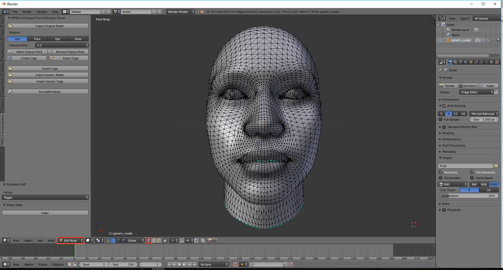
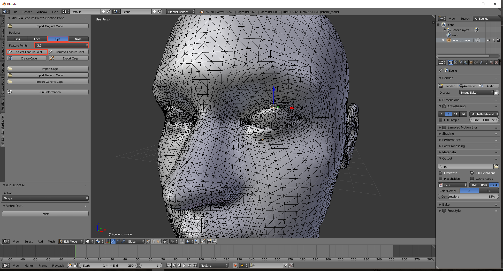

Select **Edit Mode** and **Vertex select** options (see the red rectangles in the picture below) to mark the vertices of the model.

Select the **Region** and **Feature point** type on the **MPEG-4 Standardization** panel. Mark the appropriate vertex on the 3D head model by right-clicking, then press **Select Feature Point** button.

