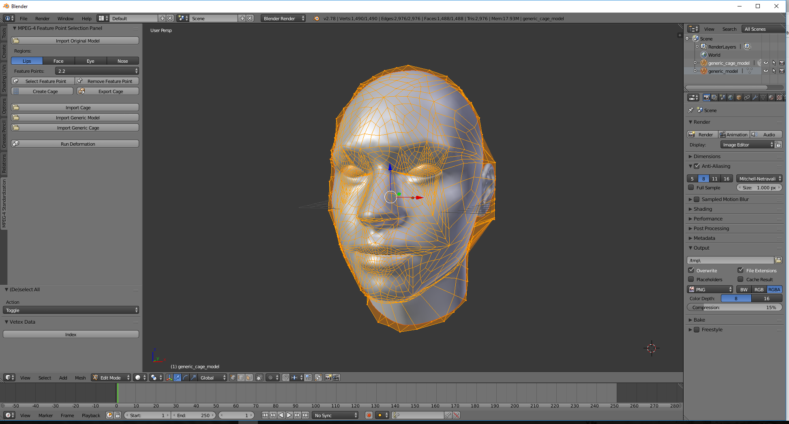

# Standardize Me Add-on for Blender

## The purpose of the add-on

**Standardize Me Add-on** was developed for standardize a 3D head model based on the MPEG-4 standard.

## Usage of the add-on

1. Download the Standardize Me Add-on ([standardize_me_addon.py](files/standardize_me_addon.py)) and install it in **Blender**. ([Installing python scripts in Blender.](videos/install_blender_addon.mp4))
2. Import a 3D head model (original model) on the **MPEG-4 Standardization** panel.
3. Mark all necessary vertices on the 3D head model. (For more information, [click here](MARK_VERTICES.md).)
4. Generate the control cage of the model with the **Create Cage** button.
5. Import the object file of the generic model ([generic_model.zip](files/generic_model.zip)), then the generic cage model ([generic_cage_model.obj](files/generic_cage_model.obj)) on the **MPEG-4 Standardization** panel.
6. Press the **Run Deformation** button to deform the generic model.
7. Export the resulted model. In the export options, you need to check in the **Keep Vertex Order** and the **Apply Modifiers** options! (See some results.)
8. This resulted model is usable in any MPEG-4 based facial animation player with the FDP file ([generic_model.fdp](files/generic_model.fdp)) of the generic model. (See sample videos.)

The whole standardization process can be seen in this [video](https://youtu.be/2X6RTRQDHWM).

## License information

Copyright © 2016 Ákos Tóth, Roland Kunkli
Permission is granted to use this add-on for non-commercial purposes.
In return, the authors ask you to mention the **Standardize Me Add-on** URL:

https://arato.inf.unideb.hu/kunkli.roland/software/standardize-me-toolkit/
    
in any scientific publication referring to work for which this add-on has been used.

THE ADD-ON IS PROVIDED "AS IS", WITHOUT WARRANTY OF ANY KIND, EXPRESS OR IMPLIED, INCLUDING BUT NOT LIMITED TO THE WARRANTIES OF MERCHANTABILITY, FITNESS FOR A PARTICULAR PURPOSE AND NONINFRINGEMENT. 
